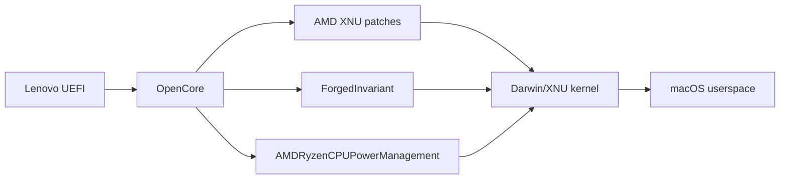

# System architecture

## Design objective

The target is a Lenovo ThinkPad T495s 20QK whose firmware, CPU, integrated GPU and several peripherals are outside Apple's native supported hardware matrix for Ventura.

The resulting system is therefore not produced by one patch. It is a layered compatibility architecture.

## Boot-time layers

```text
Layer 0 - Lenovo firmware
  Lenovo UEFI
  OEM ACPI tables
  Embedded-controller methods
  PCI/USB topology

Layer 1 - OpenCore bootstrap
  BOOTx64.efi
  OpenCore.efi
  OpenRuntime.efi
  HfsPlus.efi
  OpenCanopy.efi
  optional pre-boot audio and tools

Layer 2 - ACPI mediation
  SSDT-CPUR
  SSDT-EC
  SSDT-HPET
  SSDT-PLUG
  SSDT-PNLF
  SSDT-USBX
  SSDT-XOSI
  RTC IRQ patch
  NBCF brightness-key patch
  _OSI -> XOSI rename

Layer 3 - CPU / XNU compatibility
  AMD kernel patch set
  ProvideCurrentCpuInfo
  DummyPowerManagement
  ForgedInvariant
  AMD power-management support

Layer 4 - Apple platform identity
  SMBIOS MacBookPro16,3
  RestrictEvents CPU-name presentation
  Apple-compatible laptop service expectations

Layer 5 - runtime device enablement
  Lilu
  NootedRed
  VirtualSMC family
  AppleALC
  VoodooPS2
  NVMeFix
  USBMap
  AirportItlwm
  Intel Bluetooth stack
  RealtekRTL8111
  BrightnessKeys
  EmeraldSDHC

Layer 6 - userspace support
  brightness overlay
  Chrome safe launcher
  diagnostics
  optional historical lid-continuity scripts
  experimental touchscreen bridge
```

## Why multiple identities exist

The project has two compatibility identities with different consumers.

### Firmware-facing identity

Lenovo ACPI firmware is Windows-oriented. The `_OSI -> XOSI` mechanism changes the OS-interface query path used by selected ACPI methods.

Consumer:

```text
Lenovo firmware ACPI logic
```

Purpose:

```text
choose firmware-compatible ACPI behavior
```

### macOS-facing identity

OpenCore presents:

```text
MacBookPro16,3
```

Consumer:

```text
macOS platform frameworks and services
```

Purpose:

```text
provide a coherent Apple laptop model identity
```

These mechanisms are complementary. Neither is a general-purpose machine emulator.

## CPU execution path



The active patch set removes or replaces Intel-specific assumptions, adapts CPUID and CPU-family behavior, removes selected unsupported MSR accesses, handles timing/PAT behavior and modifies PCI behavior required by the platform.

The exact enabled patch inventory is in `KERNEL-PATCHES.md`.

## Graphics execution path


The graphics path is functionally accelerated but not stable under every workload.

The central evidence is not the existence of a Metal score. It is the combination of:

- Metal benchmark completion;
- active AMD accelerator;
- Chrome Metal command submission;
- `IOAcceleratorFamily2` hardware-error handling;
- `AMDRadeonX5000` GFX timeout/hang;
- related panic reports.

## Brightness control architecture

Brightness is a mixed kernel/userspace design because the physical panel does not provide the expected continuous response.

```text
Fn key
  -> Lenovo EC / ACPI
  -> NBCF forwarding patch
  -> BrightnessKeys
  -> macOS brightness property
  -> PNLF + NootedRed backlight control path
       -> physical panel: narrow effective range
       -> v17 overlay: visual extension below threshold
```

The userspace overlay is downstream of the macOS control value. It does not create a second independent brightness UI.

## Input architecture

The current laptop input path is deliberately PS/2-based.

```text
PS/2 controller
  -> VoodooPS2Controller
       -> VoodooPS2Keyboard
       -> VoodooPS2Trackpad
       -> VoodooInput
```

Earlier VoodooI2C experiments are not part of the active production stack.

The touchscreen is a separate device and must not be conflated with the PS/2 touchpad.

## Network architecture

```text
Intel AX200 Wi-Fi
  -> AirportItlwm

Intel Bluetooth USB device
  -> IntelBluetoothFirmware
  -> IntelBTPatcher
  -> BlueToolFixup

Realtek Ethernet
  -> RealtekRTL8111
```

Wi-Fi uses different profiles for installation and normal runtime because the installer environment is not stable with the normal AirportItlwm path on this target.

## Audio architecture

```text
Power-on pre-boot
  -> OpenCore
  -> AudioDxe
  -> startup chime path

macOS runtime
  -> AppleALC
  -> ALC257 layout 97
  -> macOS CoreAudio endpoints
```

The pre-boot and runtime audio paths are separate.

## Power architecture

No production userspace service currently claims to implement native sleep.

Native sleep is controlled by macOS power management and platform drivers.

The historical continuity mode is intentionally outside that path:

```text
lid close
  -> userspace clamshell observation
  -> lock session
  -> display sleep
  -> system suspend prevented
```

It is a display/security continuity workaround, not suspend/resume.

## Experimental touchscreen architecture

The experimental bridge assumes the operating system already exposes the physical HID device.

```text
USB/HID enumeration
  -> IOHIDManager match 1A86:E5E3
  -> X/Y and tip switch events
  -> coordinate normalization
  -> optional axis transforms
  -> CGEvent pointer synthesis
```

Current blocker:

```text
USB/HID enumeration never reaches the target controller
```

Therefore the bridge is not installed by default.

## Design rule

Compatibility layers are kept separate whenever possible.

A change made to fix one subsystem should not silently alter another subsystem. This rule motivated:

- separate installer profile for Wi-Fi;
- experimental touchscreen directory;
- independent brightness helper;
- Chrome workaround outside the EFI;
- historical power workaround outside the default installer;
- explicit current/experimental configuration separation.
