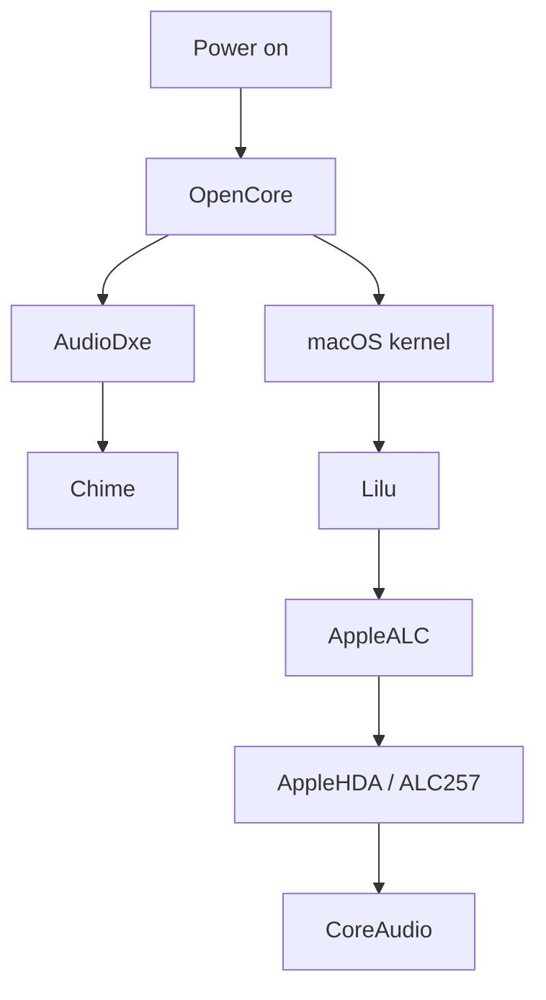

# Audio

## Architecture

The project contains two independent audio stages:

```text
pre-boot audio:
  OpenCore + AudioDxe

runtime audio:
  macOS + AppleALC + AppleHDA
```

A successful result in one stage does not prove the other stage.

## Hardware codec

Target runtime codec:

```text
Realtek ALC257
```

## macOS runtime configuration

Current components:

```text
AppleALC.kext 1.9.1
Lilu.kext 1.7.2
```

Current boot argument:

```text
alcid=97
```

Current device property also encodes:

```text
alc-layout-id = 0x61
decimal = 97
```

This duplicates the same intended layout identity in the configured path.

The public repository documents the configuration but does not contain a complete endpoint test matrix proving every:

- internal speaker channel;
- headphone jack;
- internal microphone;
- external microphone;
- mute state;
- sleep/wake restore.

Therefore the status is `Configured` unless a separate runtime test is added.

## OpenCore startup chime

v16.1 added the UEFI audio path.

Enabled driver:

```text
AudioDxe.efi
```

Current OpenCore settings:

```text
AudioCodec = 0
AudioDevice = PciRoot(0x0)/Pci(0x8,0x1)/Pci(0x0,0x6)
AudioOutMask = 1
AudioSupport = true
DisconnectHda = false
MaximumGain = -15
MinimumAssistGain = -30
MinimumAudibleGain = -55
PlayChime = Enabled
ResetTrafficClass = false
SetupDelay = 0
```

OpenCore uses its pre-boot audio resources before the macOS AppleALC stack is available.

## Chime status language

Correct:

```text
startup chime path configured
```

Not yet supported by archived evidence:

```text
startup chime audibility fully validated
```

A dedicated validation should record:

- cold boot;
- reboot;
- volume state;
- mute state;
- whether output uses internal speakers;
- whether OpenCore reports audio connection errors.

## Runtime audio versus pre-boot audio



Do not troubleshoot a missing chime by changing `alcid=97`.

Do not troubleshoot a runtime speaker route only by changing `AudioDxe`.

They are separate layers.

## Regression test

### Runtime

1. System Settings output device appears;
2. internal speaker left/right;
3. volume up/down;
4. mute;
5. headphone insert/remove;
6. microphone input;
7. 30-minute playback;
8. display sleep;
9. native sleep after power issue is repaired.

### UEFI chime

1. cold boot;
2. chime audible;
3. volume reasonable;
4. OpenCore picker remains responsive;
5. runtime audio still works after boot.

## Failure evidence to collect

OpenCore debug log:

```text
audio connection
chime playback
AudioDxe
```

macOS:

```bash
kmutil showloaded | grep -Ei 'Lilu|AppleALC'
system_profiler SPAudioDataType
ioreg -lw0 | grep -Ei 'AppleHDA|ALC'
```

A runtime audio problem should be reported with actual endpoint data rather than only "no sound".
