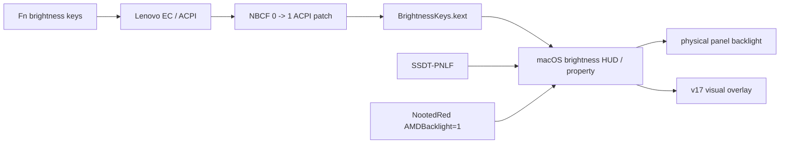

# Brightness engineering

## Current conclusion

The T495s brightness implementation is not native continuous hardware backlight control.

The current system has two different layers:

1. a valid macOS brightness control plane;
2. a non-native userspace visual-dimming extension for values the physical panel does not reproduce usefully.

The distinction is essential.

## Observed behavior

The macOS UI can expose a normal brightness slider and brightness-key response.

The panel itself behaves approximately as:

```text
requested brightness: continuous 0.0 ... 1.0
physical response: approximately two useful backlight states
```

Therefore:

```text
macOS control interface exists
physical continuous backlight actuation does not
```

## Production control path



## What each component does

### NBCF ACPI patch

Current patch:

```text
Find:    08 4E 42 43 46 0A 00
Replace: 08 4E 42 43 46 0A 01
```

The patch changes the AML integer associated with `NBCF` from `0` to `1`.

In the project, this is used to enable the Lenovo brightness-key forwarding path required by the macOS control stack.

It is not a PWM patch.

### BrightnessKeys.kext

Version:

```text
1.0.3
```

Role:

- receives supported laptop brightness-key behavior;
- integrates the key action with macOS brightness control.

It does not manufacture physical PWM range.

### SSDT-PNLF

`SSDT-PNLF.aml` provides an Apple-compatible panel/backlight device interface expected by macOS display frameworks.

This is a control-plane compatibility object.

Its presence is one reason macOS can expose laptop brightness controls.

### NootedRed AMD backlight path

Current boot argument:

```text
AMDBacklight=1
```

This enables NootedRed's AMD backlight support path.

It is part of the bridge between macOS display control and the AMD integrated display hardware.

### `IODisplayConnect` brightness property

The current userspace helper calls:

```text
IODisplayGetFloatParameter(..., "brightness", ...)
```

on `IODisplayConnect`.

This is the current numeric source used by the visual-dimming helper.

It means the helper follows the same macOS control value rather than maintaining an unrelated slider.

## Why the control path can exist without full hardware control

A display-control stack has at least two conceptually separate parts:

```text
control plane:
  event
  property
  slider
  requested value

actuation plane:
  firmware/GPU/backlight implementation
  PWM or equivalent hardware level
  actual emitted light
```

On an Apple-supported laptop, the two normally track each other closely.

On this T495s, the control plane can be made macOS-compatible while the actuation plane remains quantized or otherwise incompatible with the expected range.

This is why the project sometimes describes the solution as giving macOS "permission to control brightness".

A more precise statement is:

> The EFI exposes a macOS-compatible brightness control interface and event path. The physical panel/backlight implementation does not reproduce that interface as a useful continuous hardware range.

## Historical development

### Initial state

Before the backlight path was built:

- graphics support was incomplete;
- macOS did not provide useful native brightness control.

The project first prioritized acceleration because a backlight path built on an unusable graphics stack would not be meaningful.

### v8 accelerated baseline

v8 established the accelerated NootedRed baseline.

Brightness work after this point could therefore be tested without simultaneously changing basic graphics enablement.

### v9 PNLF experiment

v9 introduced `SSDT-PNLF.aml`.

Result:

- macOS could expose a more Apple-like backlight control path;
- physical brightness still did not become continuously adjustable.

### v11 full control-path integration

v11 combined:

```text
SSDT-PNLF
BrightnessKeys
AMDBacklight=1
NBCF patch
```

and removed the I2C touchpad stack from the active configuration while separately tuning PS/2 input.

Result:

```text
brightness UI/control path: present
physical useful range: still approximately two levels
```

This was a key diagnostic result.

It showed that the remaining problem was not simply "no slider".

### v13 NootedRed PWM scaling experiment

The v13 package modified the NootedRed binary.

Binary comparison against the upstream v12/v15 copy shows exactly seven changed bytes:

```text
offset range: 0x203e - 0x2044

original:
89 c1 c1 e1 10 29 c1

v13:
69 c8 00 ff 01 00 90
```

Original NootedRed binary SHA-256 in the compared baseline:

```text
ee6cc4b5a58c282556d82391c948d3d5931e0ace1e06df917e807c92c64604a0
```

v13 modified binary SHA-256:

```text
9e73468a843845890edac625a655eb6d0201017ab52292f907c3411b410b6c64
```

The experiment attempted to change the backlight scaling behavior.

Observed result:

- no acceptable continuous hardware range;
- brightness could become lower, but the fundamental limitation remained;
- experiment rejected.

v15 restored the upstream binary. Its SHA-256 again matches the original baseline.

This is an important example of a negative result preserved in the repository rather than presented as a successful patch.

### v15 userspace gamma bridge

Because the control value was available even when the hardware response was poor, the next design used the macOS brightness property as an input to software visual dimming.

v15 source:

```text
T495sBrightnessBridge.m
```

It read:

```text
IODisplayConnect -> brightness
```

and computed a scale below a threshold.

Conceptually:

```text
if brightness >= threshold:
    visual scale = 1
else:
    normalized = brightness / threshold
    visual scale = minimum + (1-minimum) * normalized^1.45
```

It then called:

```text
CGSetDisplayTransferByFormula(...)
```

for red, green and blue channels.

This changed the display transfer/gamma behavior and produced perceived dimming.

#### v15 installer failure

The first installer did not actually deploy the bridge successfully on the target system.

Compilation failed at:

```text
ApplicationServices/ApplicationServices.h
```

The installer also used fail-fast behavior, so the compile failure aborted later install stages.

This matters historically because a user report immediately after that failed installation could not be attributed to a bridge that had never loaded.

### v16 bridge build repair

v16 replaced the Objective-C source with a C implementation using explicit frameworks:

```text
CoreFoundation
CoreGraphics
IOKit
```

and explicit SDK discovery:

```bash
xcrun --find clang
xcrun --sdk macosx --show-sdk-path
```

The installer was also restructured so the brightness and power steps reported independent status instead of one failure aborting the entire sequence.

v16 default mapping:

```text
threshold = 0.92
minimum = 0.025
curve exponent = 1.55
poll interval = 120 ms
```

It still used:

```text
CGSetDisplayTransferByFormula
```

for continuous custom visual scaling.

### Gamma bridge instability isolation

Later testing established a significant negative result:

- with the old brightness bridge enabled, opening Chrome could cause a total freeze;
- after disabling the bridge, that bridge-specific freeze behavior stopped.

This made continuous transfer-function modification unacceptable for the final design.

The bridge was therefore removed rather than merely retuned.

The separate accelerated Chrome/NootedRed GFX hang remained a distinct issue and is documented in `GRAPHICS.md`.

## v17 safe overlay

### Design objective

Retain:

```text
native macOS slider and key input
```

while removing:

```text
continuous custom gamma-table modification
```

### Source

```text
Tools/Brightness/src/T495sBrightnessOverlay.m
```

### Input

The helper iterates `IODisplayConnect` services and reads:

```text
brightness
```

using:

```text
IODisplayGetFloatParameter
```

### Display selection

The helper searches `NSScreen.screens` and chooses a screen whose `NSScreenNumber` satisfies:

```text
CGDisplayIsBuiltin(...)
```

If no built-in screen can be selected, it falls back to the main/first screen.

### Overlay window

The helper creates a borderless AppKit window with:

```text
background: black
opaque: false
shadow: false
ignoresMouseEvents: true
hidesOnDeactivate: false
canHide: false
animation duration: 0
window level: NSScreenSaverWindowLevel - 1
sharingType: NSWindowSharingNone
```

Collection behavior:

```text
CanJoinAllSpaces
Stationary
FullScreenAuxiliary
IgnoresCycle
```

This design attempts to:

- cover the built-in display;
- follow Spaces;
- remain present in fullscreen contexts;
- avoid stealing pointer interaction;
- avoid appearing in window sharing.

### Mapping function

Defaults:

```text
threshold T = 0.90
maximum alpha A = 0.90
curve C = 1.35
poll interval = 250 ms
```

For brightness `b`:

```text
b = clamp(b, 0, 1)

if b >= T:
    alpha = 0
else:
    progress = 1 - b/T
    alpha = A * progress^C
```

The source clamps parameters to:

```text
threshold: 0.50 ... 1.00
maximum alpha: 0.00 ... 0.94
curve: 0.50 ... 3.00
interval: 0.10 ... 2.00 seconds
```

### What the overlay does

It reduces perceived luminance by placing a semi-transparent black surface above normal application content.

It does not:

- lower panel PWM below the physical hardware floor;
- save the same backlight power as genuine hardware dimming;
- rewrite NootedRed;
- change EFI brightness values;
- change the physical panel firmware.

### ColorSync restoration call

The current v17 source does call:

```text
CGDisplayRestoreColorSyncSettings()
```

at:

- startup;
- session/wake reactivation;
- `--restore-only` migration mode.

This is retained to clear any custom gamma state left by the retired bridge.

The accurate statement is therefore:

> v17 does not continuously write a custom gamma curve. It performs ColorSync restoration calls to remove legacy custom transfer state.

The documentation must not incorrectly claim that the source never touches ColorSync-related state at all.

## v17 installer behavior

`Tools/Brightness/Install.command`:

1. locates `clang`;
2. locates the macOS SDK;
3. compiles the Objective-C source with ARC;
4. links AppKit, CoreGraphics and IOKit;
5. unloads the retired gamma LaunchAgent;
6. kills old bridge/overlay processes;
7. deletes the retired bridge binary;
8. installs the new overlay binary;
9. executes `--restore-only`;
10. writes a per-user LaunchAgent;
11. bootstraps and kickstarts the new agent.

The root `Tools/Install.command` also configures trackpad preferences.

It does not alter `pmset`.

## LaunchAgent

Label:

```text
com.terabitlab.t495s-brightness-overlay
```

Session:

```text
Aqua
```

Behavior:

```text
RunAtLoad = true
KeepAlive = true
ThrottleInterval = 10
ProcessType = Interactive
```

Logs:

```text
~/Library/Logs/T495sBrightnessOverlay.log
```

## Current validation status

The architecture is implemented.

However, the final AppKit overlay was created after the unsafe gamma bridge was isolated, and the public evidence archive does not contain a sustained target-machine validation cycle for the final overlay.

Therefore the correct current status is:

```text
implemented
pending sustained target revalidation
```

It must not be labeled `fully working` until that validation is completed.

## Required validation for promotion to observed working

1. install v17 overlay;
2. reboot;
3. verify agent remains loaded;
4. exercise full brightness range;
5. verify pointer input passes through overlay;
6. test multiple Spaces;
7. test fullscreen video;
8. test Chrome with GPU acceleration disabled;
9. test Chrome with GPU acceleration enabled only for diagnostic reproduction, not normal use;
10. test screen lock/unlock;
11. test display sleep/wake;
12. run for at least 2 hours;
13. confirm no WindowServer crash;
14. confirm no GPU reset attributable to overlay;
15. confirm no color-profile corruption after uninstall.

## Emergency disable

```bash
Tools/Brightness/Disable.command
```

Re-enable:

```bash
Tools/Brightness/Enable.command
```

Uninstall:

```bash
Tools/Brightness/Uninstall.command
```

## Acceptance criteria for native brightness

The project should only claim native continuous backlight control if all of the following are true without userspace dimming:

1. macOS slider changes physical backlight;
2. at least 8 visually distinct hardware levels exist;
3. minimum level is materially dimmer than current hardware floor;
4. changes survive lock/unlock;
5. changes survive display sleep/wake;
6. no overlay/gamma helper is running;
7. power draw changes consistently with backlight level.

The current system does not meet those criteria.

## Final terminology

Use:

```text
macOS brightness control path: working
continuous physical hardware backlight: not solved
safe visual extension: implemented, pending revalidation
```

Do not use:

```text
native brightness fully fixed
```
