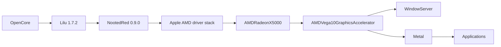

# Graphics subsystem

## Current conclusion

Graphics acceleration is functional but not reliable.

This is the primary unresolved platform issue.

The correct status is not:

```text
GPU acceleration broken
```

because Metal and the Apple AMD accelerator are demonstrably active.

It is also not:

```text
GPU acceleration fixed
```

because accelerated Chrome workloads have produced reproducible GPU hangs and complete system lockups.

The supported conclusion is:

> The Vega 10 acceleration path is operational, benchmarkable and usable for some workloads, but it has a reproducible accelerated-workload stability failure.

## Hardware

```text
AMD Radeon Vega 10
PCI vendor: 0x1002
PCI device: 0x15D8
Revision: 0x00D1
Reported VRAM: 2 GB
ROM version: 113-PICASSO-117
```

Captured display output:

```text
1920 x 1080
60 Hz
built-in display
online
Metal: supported
```

## Software path



The current EFI also injects:

```text
GPU model = AMD Radeon Vega 10
AMDBacklight=1
```

The backlight boot argument is related to the display-control path. It should not be interpreted as a general GPU stability fix.

## Historical enablement

### Early state

Early development states had macOS graphics without a usable accelerated Vega 10 path.

A critical dependency failure was captured when NootedRed was paired with an older Lilu:

```text
Lilu loaded: 1.6.8
NootedRed requested compatible Lilu version: 1.7.0
NootedRed failed to resolve library dependencies
```

The project corrected the dependency pair and later used:

```text
Lilu 1.7.2
NootedRed 0.9.0
```

### v5 control

v5 deliberately preserved a no-NootedRed control configuration.

Purpose:

- prove boot behavior independent of NootedRed;
- separate graphics enablement from general OpenCore bootability.

### v6-v8

NootedRed was reintroduced and the package layout was normalized.

v8 became the verified accelerated baseline used for later subsystem experiments.

### v9 onward

Wake/backlight investigation began from the accelerated baseline rather than continuing to mix boot and acceleration changes.

This separation is important because later failures can be compared against a known accelerated EFI state.

## Evidence that acceleration is active

### Apple accelerator state

Captured IORegistry/diagnostic data contains:

```text
AMDRadeonX5000_AMDVega10GraphicsAccelerator
state: ENABLED
```

### Metal benchmark completion

The machine completed Geekbench 6 Metal runs:

```text
11179
5164
```

These results prove that command submission through Metal can work.

They do not prove that every Metal workload is stable.

### Internal display

macOS reports the Vega 10 as the graphics device driving the built-in panel.

## Chrome failure reproduction

The machine owner reported:

- opening Chrome with acceleration enabled can produce serious artifacts;
- after continued use, the entire machine can stop responding;
- Geekbench Metal can still pass;
- disabling Chrome graphics acceleration makes Chrome function normally.

That difference is diagnostically important.

A synthetic compute/render benchmark and a long-lived browser compositor do not exercise identical:

- command-buffer patterns;
- WebGPU/Metal translation paths;
- video-decode paths;
- surface allocation/reuse;
- synchronization behavior;
- WindowServer interaction.

Therefore a passing Geekbench run does not invalidate the Chrome failure.

## Captured GPU reset

The diagnostic archive contains a macOS GPU restart report with:

```text
Event: GPU Reset
Application: Google Chrome Helper
Graphics Hardware: AMD Radeon Vega 10
Restart Channel: 13 GFX
```

The first pending command buffer is associated with:

```text
PID: Google Chrome Helper
SubmitContext: Metal
VMID: 11
```

The report also contains shader hashes labeled:

```text
dawn_entry_point
```

which is consistent with a browser GPU/WebGPU translation path. The repository does not require that label to establish root cause; the stronger evidence is the application, Metal submit context and AMD GFX reset.

## Captured system log

The same diagnostic set records:

```text
IOAcceleratorFamily2: Signaling hardware error on channel 0
GPURestartSignaled
GPURestartEnqueued
AMDRadeonX5000: channel 0 GFX event timeout
AMDRadeonX5000: channel 0 GFX is hung
```

This is direct evidence of a driver/hardware-command-channel failure, not merely a Chrome process crash.

## Panic evidence

Two panic reports collected in the same diagnostic period contain:

```text
NMIPI for unresponsive processor: TLB flush timeout
```

with backtrace entries in:

```text
AMDRadeonX5000_AMDVega10Hardware::writeDiagnosisReport
AMDRadeonX5000_AMDGraphicsAccelerator::writeDiagnosisReport
AMDRadeonX5000_AMDAccelChannel::getHardwareDiagnosisReport
IOAcceleratorFamily2::restart...
IOAcceleratorFamily2::hardwareErrorEvent...
```

Interpretation:

- the graphics subsystem had already entered an error/restart path;
- the diagnostic/restart path was associated with an unresponsive-processor/TLB timeout panic;
- this supports severe platform-wide consequences from the GPU fault.

It does not prove that every observed system freeze has exactly the same internal sequence.

## Secondary panics

Two additional panic reports in the same collected archive include:

- `AMDRyzenCPUPowerManagement` timer callback path;
- `SMCProcessorAMD` stop path;
- multiprocessor rendezvous/entry timeout behavior.

These are documented but are not currently designated as independent root causes.

Reasons:

1. they were captured during a period of general instability;
2. they have not been isolated with a repeatable trigger independent of graphics;
3. a kext appearing in a panic backtrace does not automatically mean the kext initiated the failure.

A future investigation should reproduce them with graphics stress removed before changing the AMD CPU/SMC support stack.

## Retired brightness bridge interaction

The v15/v16 brightness bridge continuously changed the display transfer formula through CoreGraphics.

The machine owner reported a total freeze when opening Chrome while that bridge was active.

Disabling the bridge removed that specific bridge-triggered behavior.

This isolated the gamma bridge as an independent instability source.

However, subsequent accelerated Chrome testing still produced artifacts/hangs without relying on that bridge. Therefore:

```text
gamma bridge instability != complete explanation for Chrome GPU instability
```

Both facts must remain in the record.

## Current Chrome workaround

User-confirmed practical workaround:

```text
Chrome graphics acceleration disabled
```

The repository provides:

```text
Tools/Chrome/Launch-Safe.command
```

with:

```text
--disable-gpu
--disable-gpu-compositing
--disable-accelerated-video-decode
```

This forces Chrome away from the failing accelerated path.

## Why this is a workaround, not a fix

The workaround:

- prevents Chrome from using the problematic GPU path;
- improves practical browser stability.

It does not:

- repair `AMDRadeonX5000`;
- patch NootedRed;
- reset a hung GPU channel;
- make WebGPU/Metal stable;
- validate other hardware-accelerated applications;
- solve sleep/wake graphics callbacks.

Documentation must use the term `workaround` or `containment`, not `GPU fix`.

## Safe use policy

Until a native graphics fix is demonstrated:

```text
Chrome hardware acceleration: off
```

For other Chromium applications, accelerated rendering should be considered suspect if similar artifacts/hangs occur.

If an application exposes a software-rendering switch, it can be used as an isolation test.

## Reproduction procedure

### Accelerated test

1. boot the known production EFI;
2. ensure the retired gamma bridge is not running;
3. confirm NootedRed/Lilu load;
4. launch Chrome normally with graphics acceleration enabled;
5. reproduce the artifact/hang;
6. if the machine restarts, collect `.gpuRestart` and `.panic` reports immediately.

### Software-rendering control

Launch:

```bash
Tools/Chrome/Launch-Safe.command
```

or disable graphics acceleration in Chrome settings.

If the software-rendered control remains functional while accelerated mode fails, the result supports a GPU-path classification.

## Minimum diagnostic set

Before accelerated test:

```bash
system_profiler SPDisplaysDataType
kmutil showloaded | grep -Ei 'Lilu|NootedRed'
ioreg -lw0 | grep -Ei 'AMDRadeon|IOAccelerator|IOFramebuffer'
nvram boot-args
```

After forced restart:

```bash
find /Library/Logs/DiagnosticReports \
     "$HOME/Library/Logs/DiagnosticReports" \
     -type f \
     \( -iname '*gpuRestart*' -o -iname '*panic*' -o -iname '*WindowServer*' \)
```

See `DIAGNOSTICS.md` for the full collector.

## Candidate technical areas for future work

These are investigation areas, not asserted fixes:

- NootedRed revision/regression comparison;
- Apple AMD driver state around Vega 10 GFX channel timeout;
- PAT/MTRR behavior;
- Chrome/ANGLE/Dawn Metal path;
- hardware video decode;
- WindowServer surface/compositor interaction;
- power-state transitions of the graphics stack;
- secondary CPU rendezvous behavior during GPU reset.

Any experiment must preserve a known-good bootable EFI and change one variable at a time.

## Acceptance criteria for calling acceleration "stable"

All of the following should pass:

1. 10 consecutive normal boots;
2. 5 Geekbench Metal runs;
3. 60 minutes of accelerated Chrome browsing/video;
4. WebGL/WebGPU workload if enabled;
5. fullscreen video;
6. display sleep/wake;
7. at least 10 native sleep/wake cycles after sleep is separately repaired;
8. no `gpuRestart`;
9. no `AMDRadeonX5000` channel timeout;
10. no AMD/IOAccelerator panic.

Until then, the correct status remains:

```text
Metal operational
accelerated GPU stability unresolved
Chrome software-rendering workaround confirmed
```
