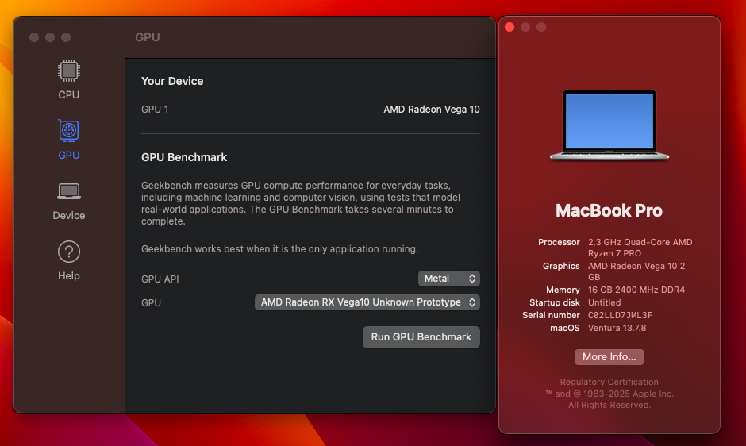
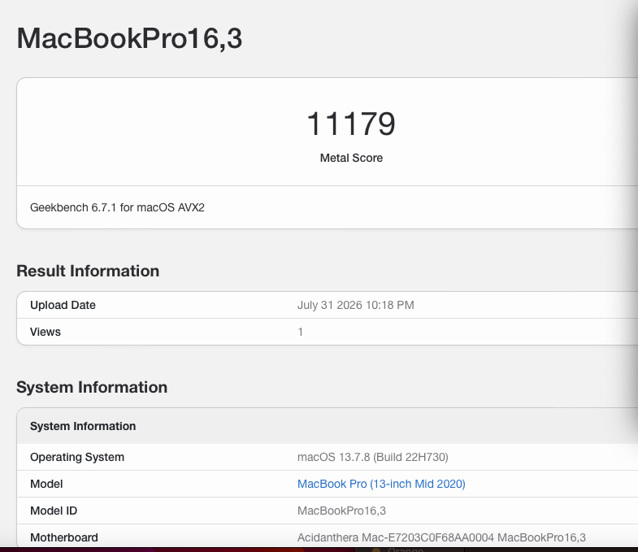
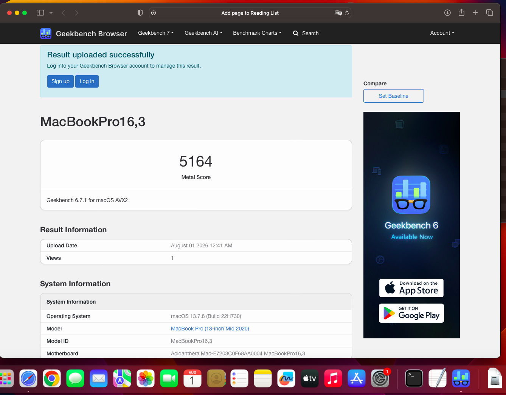
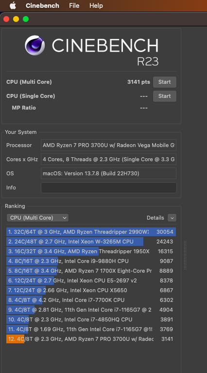
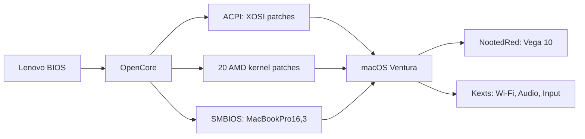

# ThinkPad T495s Hackintosh - macOS Ventura | AMD Ryzen 7 PRO 3700U + Radeon Vega 10


macOS Ventura running natively on a Lenovo ThinkPad T495s with full Metal GPU acceleration via NootedRed. One of the few working AMD laptop Hackintosh builds with Vega 10 (Picasso).

## Proof

| About This Mac |
|:---:|
|  |

| Geekbench 6 Metal - 11179 | Geekbench 6 Metal - 5164 (on battery) | Cinebench R23 Multi-Core - 3141 |
|:---:|:---:|:---:|
|  |  |  |

## Hardware

| Component | Spec |
|---|---|
| Laptop | Lenovo ThinkPad T495s (type 20QK) |
| CPU | AMD Ryzen 7 PRO 3700U, 4 cores / 8 threads |
| GPU | AMD Radeon Vega 10 (Picasso mobile iGPU) |
| RAM | 16 GB DDR4-2400 |
| Display | 1920x1080, 60 Hz |
| Wi-Fi | Intel AX200 |
| Bluetooth | Intel |
| Audio | Realtek ALC257 |
| Ethernet | Realtek RTL8111 |
| Storage | NVMe (Crucial P3 Plus) |
| Touchpad | Elan PS/2 |

## What works

| Feature | Status |
|---|---|
| macOS Ventura 13.7.8 boot | Working |
| AMD Ryzen 7 PRO 3700U | Working (4C/8T, Cinebench R23: 3141) |
| Radeon Vega 10 + Metal | Working (Geekbench Metal: 11179) |
| Internal display 1080p 60Hz | Working |
| Keyboard | Working |
| Trackpad (Elan PS/2) | Working |
| Wi-Fi (Intel AX200) | Working after installation |
| Bluetooth | Working |
| NVMe storage | Working |
| USB ports | Working |
| Battery status | Working |
| Brightness keys + slider | Working (interface) |
| Brightness visual dimming | Working (software overlay) |
| Audio (AppleALC alcid=97) | Configured |
| Ethernet (RTL8111) | Configured |
| SD card reader | Configured |

## What doesn't work (known issues)

| Issue | Details |
|---|---|
| GPU hangs with Chrome | Chrome hardware acceleration causes AMD GFX channel hangs and system freezes. **Workaround:** disable GPU acceleration in Chrome, or use `Tools/Chrome/Launch-Safe.command` |
| Native Sleep/Wake (S3) | Unreliable. The GPU/NootedRed cannot reliably restore state after S3 resume. See the Sleep section below. |
| Wi-Fi during macOS installer | Intel Wi-Fi can crash the installer. Use Ethernet or the no-Wi-Fi config profile. Switch to normal config after install. |
| Touchscreen | Not detected by macOS (controller not enumerated in USB/HID tree). Experimental bridge in repo but non-functional. |
| Physical brightness PWM | Only ~2 hardware levels. Software overlay compensates visually. |

## How it works



**In short:** OpenCore sits between the Lenovo firmware and macOS. It tells the BIOS what it needs to hear (Windows-compatible responses), patches the kernel for AMD, and presents an Apple identity to macOS.

## Why the pre-boot "Windows" layer exists

The ThinkPad T495s firmware was written for Windows. Its ACPI tables make decisions like:

```
if (_OSI("Windows 2015"))
    expose device path A
else
    expose device path B
```

This affects: embedded controller, hotkeys, brightness, lid switch, battery, sleep/wake, trackpad, USB, and more.

**Solution:** OpenCore redirects `_OSI` to a custom `XOSI` table, which gives the firmware the Windows-compatible answers it expects. This makes Lenovo expose hardware on the paths macOS can then use.

**What this is NOT:** It's not Windows emulation. There's no Windows kernel, no Win32 API, no virtual machine. It's just telling the BIOS the right answers so it exposes hardware correctly.

```
Lenovo firmware asks: "Are you Windows?"
XOSI answers: "Yes" (so firmware follows the right path)
macOS boots on top of the resulting hardware topology
```

## Brightness - why custom software was needed

macOS sees a working brightness slider and keys. But the physical panel only responds with ~2 useful hardware levels regardless of the requested value.

**The problem:**
```
macOS requests: 100%  -> panel: bright
macOS requests: 50%   -> panel: slightly darker  
macOS requests: 10%   -> panel: same as 50%
```

Only about 2 physical PWM levels actually work. The AMD/Picasso display engine doesn't translate macOS brightness values into a continuous PWM curve on this panel.

**Solution:** A safe AppKit overlay that reads the brightness property and adds visual dimming on top. When you set brightness to 20%, the panel stays at its hardware level, but a transparent dark overlay makes it look like 20%.

This is **perceptual brightness emulation**, not physical PWM backlight control. The LED backlight doesn't actually consume less power at lower visual brightness.

**Why not gamma/ColorSync?** That was the first approach (v15-v16). It worked visually but conflicted with Chrome's Metal/GPU pipeline and caused GPU crashes. The v17 AppKit overlay avoids touching the graphics pipeline entirely.

## Sleep - S0 pseudo-sleep (not real S3)

**The real problem:** macOS can enter S3 sleep, but waking back up fails because the NootedRed/AMD GPU cannot reliably restore its state after suspend. The display doesn't come back, or the system freezes.

**Workaround:** Instead of risking a broken S3 resume, the system stays in S0 (running) and emulates the sleep experience:

```
Close lid
  -> ACPI lid event detected
  -> session locks
  -> display turns off
  -> low-power policy applied
  -> CPU enters idle C-states (C1/C2/C3)

Open lid
  -> display resumes immediately
  -> session unlock
  -> no S3 resume needed (GPU state never lost)
```

**Important distinction:**
- **S3** = suspend to RAM (CPU off, GPU off, very low power, wake = full hardware restore)
- **S0 pseudo-sleep** = OS running, display off, CPU idle, GPU stays initialized

**Advantage:** No GPU state restoration needed at wake. Much more reliable.

**Disadvantage:** Higher power consumption than real S3. Don't leave it in a bag for hours — the system is still running.

This is referred to as **S0-based emulated clamshell sleep** or **lid continuity mode** in the documentation.

## Installation (step by step)

### Step 1 — Make a bootable USB

1. Download **both ZIPs** from [Releases](https://github.com/vluncasu/ThinkPad-T495s-macOS/releases)
2. Create a macOS Ventura USB installer ([guide](https://dortania.github.io/OpenCore-Install-Guide/installer-guide/))
3. Mount the USB's EFI partition (`sudo diskutil mount disk#s1`)
4. Copy the `EFI/` folder from the downloaded ZIP to the USB's EFI partition

### Step 2 — Install macOS

5. Boot from USB (F12 at BIOS → select USB)
6. Pick "Install macOS Ventura" in OpenCore boot picker
7. Install macOS normally (format disk as APFS, follow the prompts)
8. **Wi-Fi note:** Intel Wi-Fi (AirportItlwm) can crash the macOS installer on this hardware. If the installer freezes or kernel panics, install without Wi-Fi — use Ethernet or no network at all. To disable Wi-Fi in the bootloader: on the USB EFI partition, replace `EFI/OC/config.plist` with `EFI/OC/Config-Profiles/config-install-no-wifi.plist` (just rename it to `config.plist`). After macOS is installed, put the original `config.plist` back — Wi-Fi works fine in the installed system.

### Step 3 — Transfer EFI to internal disk (stop booting from USB)

Right now macOS only boots because the USB has the EFI bootloader. To boot without the USB, the EFI folder must be copied to the internal disk's hidden EFI partition.

**Automatic (recommended):**

9. Boot into macOS from USB one last time
10. Open Terminal and run:
```bash
/Volumes/USB_NAME/Tools/Transfer-EFI.command
```

**Manual (if the script doesn't work):**

```bash
# Find your internal disk's EFI partition (usually disk0s1)
diskutil list

# Mount it
sudo diskutil mount disk0s1

# Copy EFI from USB to internal
sudo cp -R /Volumes/USB_NAME/EFI /Volumes/EFI/

# Verify
ls /Volumes/EFI/EFI/OC/config.plist
```

After this, remove the USB and reboot. The laptop boots macOS from the internal disk on its own.

### Step 4 — Post-install fixes

11. Run `Tools/Install.command` — sets up:
    - **Trackpad**: tap-to-click, right-click, proper gesture config
    - **Brightness overlay**: software dimming (hardware only has ~2 levels)
12. Run `Tools/Power/Enable-Continuity.command` — sets up:
    - **S0 pseudo-sleep**: lid close = screen off + lock + low power (not real S3)
13. Run `Tools/Chrome/Launch-Safe.command` instead of Chrome normally — disables GPU acceleration to prevent system freezes

### Step 5 — Generate SMBIOS (required for Apple services)

14. Download [GenSMBIOS](https://github.com/corpnewt/GenSMBIOS), run it, pick model `MacBookPro16,3`
15. Edit `EFI/OC/config.plist` on the internal EFI partition — replace the FAKE values:
```
SystemSerialNumber = C02DEMO00000        <- replace
MLB                = C02DEMO0000000000   <- replace
SystemUUID         = 00000000-...        <- replace
ROM                = 000000000000        <- replace
```
Without real SMBIOS values: no iCloud, no iMessage, no FaceTime, no App Store.

### macOS version note

Upgrading to other macOS versions (Sonoma, Sequoia) is possible with this EFI, but only **macOS Ventura 13.7.8** has been tested and verified on this hardware. Start with Ventura for a stable experience. If upgrading later, back up the working EFI first.

## Kexts included

| Kext | Version | Purpose |
|---|---|---|
| Lilu | 1.7.2 | Patching engine |
| NootedRed | 0.9.0 | Vega 10 GPU acceleration + Metal |
| VirtualSMC | 1.3.3 | SMC emulation |
| AppleALC | 1.9.1 | Audio codec |
| VoodooPS2Controller | 2.3.5 | Keyboard + Trackpad |
| AirportItlwm | 2.3.0 | Intel Wi-Fi |
| IntelBluetoothFirmware | 2.4.0 | Bluetooth firmware |
| IntelBTPatcher | 2.4.0 | BT fixes |
| BlueToolFixup | 2.6.8 | BT Ventura compatibility |
| RealtekRTL8111 | 2.4.2 | Ethernet |
| NVMeFix | 1.1.1 | NVMe power management |
| ECEnabler | 1.0.4 | Battery EC reading |
| SMCBatteryManager | 1.3.3 | Battery UI |
| SMCProcessorAMD | 1.0.1 | CPU sensors |
| SMCRadeonSensors | 2.1.0 | GPU sensors |
| BrightnessKeys | 1.0.3 | Fn brightness keys |
| RestrictEvents | 1.1.4 | Event filtering |
| ForgedInvariant | 1.0.0 | TSC sync |
| AMDRyzenCPUPowerManagement | 0.7.1 | CPU power management |
| EmeraldSDHC | 0.1.2 | SD card reader |
| USBMap | 1.1 | USB port map |
| AppleMCEReporterDisabler | 1.2 | Disable MCE reporter |

## Repository structure

```
EFI/                       -- Copy this to your EFI partition
  OC/config.plist          -- Main OpenCore config
  OC/Config-Profiles/      -- No-Wi-Fi installer config
  OC/Kexts/                -- Kernel extensions
  OC/ACPI/                 -- Custom SSDT tables (including XOSI)
  OC/Drivers/              -- UEFI drivers
Tools/                     -- Post-install helpers
  Transfer-EFI.command     -- Copies EFI from USB to internal disk
  Install.command          -- Trackpad + brightness setup
  Brightness/              -- Brightness overlay (build + install)
  Chrome/                  -- Chrome safe-launch (GPU disabled)
  Power/                   -- Lid continuity / S0 pseudo-sleep
  Diagnostics/             -- System info collection
Experimental/              -- Touchscreen (non-functional)
Docs/                      -- Full technical documentation
```

## Documentation

For deeper technical details: [`Docs/`](Docs/README.md)

Key documents:
- [INSTALLATION.md](Docs/INSTALLATION.md) — full install guide
- [GRAPHICS.md](Docs/GRAPHICS.md) — GPU acceleration and crash details
- [BRIGHTNESS.md](Docs/BRIGHTNESS.md) — brightness engineering
- [POWER-SLEEP.md](Docs/POWER-SLEEP.md) — sleep/wake investigation
- [KNOWN-ISSUES.md](Docs/KNOWN-ISSUES.md) — all problems and workarounds
- [KERNEL-PATCHES.md](Docs/KERNEL-PATCHES.md) — the 22 AMD kernel patches
- [DEVELOPMENT-HISTORY.md](Docs/DEVELOPMENT-HISTORY.md) — v2 through v17 history

Hardware reference (Windows-side dumps from AIDA64):
- [AIDA64-ACPI-TREE.txt](Docs/Evidence/AIDA64-ACPI-TREE.txt) — complete ACPI tree of this ThinkPad T495s
- [AIDA64-FULL-REPORT.html](Docs/Evidence/AIDA64-FULL-REPORT.html) — full hardware report (open in browser)

## Search keywords

<details>
<summary>Search terms</summary>

ThinkPad T495s Hackintosh, Lenovo T495s macOS, AMD Ryzen 3700U Hackintosh, Radeon Vega 10 Hackintosh, Vega 10 laptop macOS, AMD laptop Hackintosh, Picasso iGPU macOS, NootedRed Vega 10, OpenCore AMD laptop, macOS Ventura AMD, Ryzen mobile Hackintosh, ThinkPad Hackintosh, Lenovo AMD Hackintosh, Vega 10 Metal macOS, 20QK Hackintosh, AMD mobile GPU macOS, Hackintosh laptop AMD Ryzen, EFI AMD Vega, OpenCore Ryzen 7 laptop.

</details>
